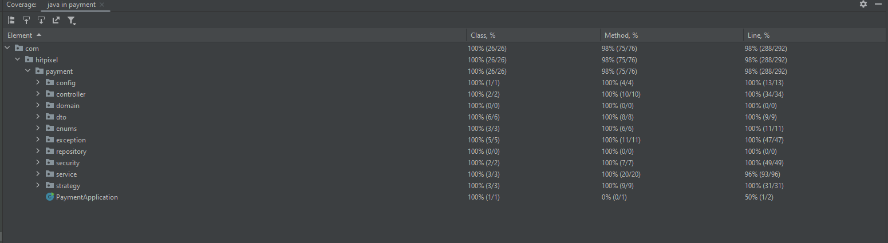

# Payment API Service
A simple restful service to register and authenticate users, make payments and fetch details about payments

# Technologies used
- Java 17
- Maven
- Spring Boot 3
- H2 In memory DB
- Docker
- Junit, Mockito
- Apache Tomcat 

# Installation

### Stand alone deployment
- Unzip the project on your system
- open a terminal or cmd in the directory where you have the project
- run the following command on the prompt: **mvn clean install**
- wait till the build is completed and successful
- run the following command on the prompt: **java -jar target/payment-0.0.1-SNAPSHOT.jar**
- service should be up and running, you can test via postman

### Docker Deployment
- Unzip the project on your system
- open a terminal or cmd in the directory where you have the project
- run the following command on the prompt: **docker build -t payment-api .**
- This will build the image from the dockerfile present in the project
- run the following command on the promp: **docker run -d -p 8080:8080 payment-api**
- This will deploy the image as a container
- service should be up an running, you can test via postman

# API

	GET /actuator/health
to get health of the application

	POST /api/users/register
API to register users with the system

	POST /api/users/login
API to login into the system

	POST /api/payments
API to make payments in the system, requires authentication

	GET /api/payments/history
API to fetch transaction history of a user, requires authentication

	GET /api/payments/{transactionId}/status
API to fetch transaction status of a particular transaction, requires authentication

	POST /api/payments/{transactionId}/refund
API to refund a particular transaction.

## Swagger 
More documentation related to API's can be found here.
Please add bearer token for all the payment API's

[http://localhost:8080/swagger-ui/index.html](http://localhost:8080/swagger-ui/index.html)

## H2 DB
To connect to H2 database web based UI
[http://localhost:8080/h2-console](http://localhost:8080/h2-console)
- use JDBC URL as **jdbc:h2:mem:testdb**
- use username as **sa**
- keep the password empty

# Test & Coverage

Added unit test and integration tests for different layers
- Controller layer tests using WebMvcTest
- DAO layer tests using DataJpaTest
- Service layer tests using Mockito
- End-to-End integration tests using SpringBootTest

Achieved coverage > 95%

# Sonar Scans
solved all major sonar issues
